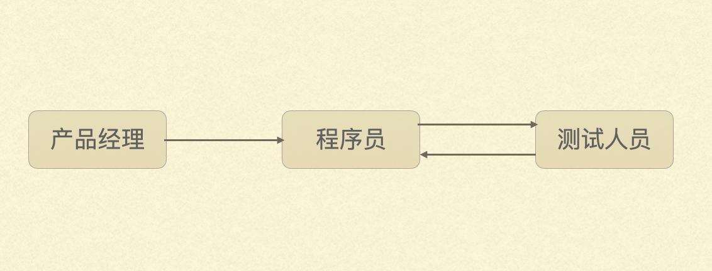

# 如何借助错误应对复杂问题 -- 程序员如何一边写bug一边写代码

## 引言 

冒昧地请你回忆一下，你上次犯错是什么时候？从这个错误中，你有什么收获？ 

为什么要讲错误这个话题？借用电影“无间道”梁朝伟对刘德华说的一句台词：“对不起，我是程序员。”

 你肯定遇到过类似手机App卡住，突然闪退，更新之后某某功能不能用了之类的情况，那便是我们程序员挖的坑。对了，我们把这个坑叫做bug，bug原本的意思是虫子，在这里可以把它理解为缺陷、错误。因此，我们调试程序，解决bug的过程也会被戏称为“捉虫”。 

正如网友说的，“没有在深夜哭泣过的人，不足以谈人生”。“没有在深夜捉虫的程序员，不足以谈开发”。 嗯，我通宵调试，两耳不闻人声，只有键盘在歌唱。

所以，我们经常也会被测试和产品的小伙伴嘲笑：“你今天又写了几个bug呀？” 

##  挑战是什么？ （软件频繁添加新功能，修改旧工程，依旧保持可以正常使用）

为什么会这样？一部分原因是：“不是码农无能，而是bug太‘狡猾’！” 

软件之所以被称为软件，就是相对于电脑、手机这些硬件，软件会被不断地修改，功能越来越多，越来越复杂，这也就意味着越来越容易出错。你看，我们的手机买到手之后，不会功能上的变化。但是手机里的“得到”App， 恨不得一周一个版本。所以我们在发布新版本的时候，面临两个挑战

1. 新实现的这些功能必须是正常可用的。
2. 上一个版本正常的功能要仍然是正常的。

你也许以为第二点很容易，不应该天生如此吗？想象一下，如果你的手机每周拆卸一次，改个零件，换个模块，会不会容易出问题。

举个大家熟悉的得到阅读器的例子，这是TF Boy刀哥在知识城邦里的道歉，一次重大的升级，升级之后，最重要的电子书突然不能用了。

## 解决方案 

在软件开发领域一整套的解决方案、流程来应对bug，包括代码评审，黑盒白盒测试，bug跟踪和复盘等等。今天我把最有“技术含量”的那一部分——测试驱动开发，拿出来分享。

举个例子，我们现在要开发一个汇率转换的小模块1.0版本，很简单，假设现在人民币美元的汇率是6：1，你兑换6元人民币，就能得到1美元。

### 常见开发流程

常见的开发流程是这样的，程序员按照产品经理的需求开发完程序，然后提交给测试人员。测试人员发现问题，再反馈给开发人员。一直重复，直到没有bug。

就上面人民币和美元兑换的例子，测试人员大概会这么测试

1. 输入6元人民币是不是能换1美元
2. 输入100元人民币兑换的美元是不是xxx
3. 0 元人民币
4. 输入一个负数是不是能报错误，或者界面上就不允许用户输入一个负数
5. 假设最大兑换金额是10000人民币，10000能兑换对少美元？

这个流程有什么问题？

1. 错误反馈的时间太长了，像我们很多时候是一个月发一个版本，如果依赖测试人员发现错误，基本上要等两周才能得到反馈。
2. 理论上讲，每一次小的改动，都可能引起其它地方出问题。上面举的得到阅读器电子书无法访问的bug就是个例子。我猜，测试同学只验证了最后一轮的几个bug，导致没有发现这个明显的问题。

### 测试驱动开发

测试驱动开发的核心步骤

1. 在写功能代码之前，先写一个测试的代码，这个测试肯定会失败，因为具体的功能还没实现。
2. 编写功能代码，让测试通过即可。（这个过程一般就几分钟）
3. 编译通过完之后，看看是否有必要优化代码结构，例如提取一些功能，消除重复的代码。
4. 重复1-3.

也是上面那5个测试用例，这一回是由程序员编写测试代码来验证功能，而不是测试手动输入来测试。从第一个测试用例到最后一个，当程序完成的时候，也就有了5个测试用例。

1. 6元人民币是不是能换1美元
2. 100元人民币兑换的美元是不是xxx
3. 0 元人民币
4. 输入一个负数是不是能报错误，或者界面上就不允许用户输入一个负数
5. 假设最大兑换金额是10000人民币，10000能兑换对少美元？

测试遇到bug了怎么处理？

例如测试输入10001元人民币，并没有提示超出最大可兑换金额。其实类似的，把bug当做一个失败的测试，继续上面的流程就可以了。

## 应对复杂问题的3个心法

解决类似软件开发这种复杂问题，有3个心法：

1）小步迭代，快速反馈

测试驱动驱动开发最重要一点就是小布迭代的节奏。因为步子小，如果有问题，能够马上发现，这个周期大概就十几分钟。错误发现地越早，解决的代价就越低。

2）稳中求进，叠加进步

因为有测试用例的存在，每完成一个新功能，都可以保证在我们已知的范围内是正常的。当新版本中不小心改到旧功能时，能够在第一时间被测试用例发现。

~~有时候软件开发就像领兵打仗，在前方攻城略地的同时，要保证后方稳定，而不是丢盔卸甲。~~

3）关键操作，不断重复

找到能持续提升质量和能力的关键操作，程序员找到测试驱动，医生找到“清单革命”，项目经理找到每日例会等等，你找到了什么？

错误不是我们前进的绊脚石，而是前进的探照灯。它界定了我们正确行为的边界。有了这样的认识，就会明白，每次犯错不是自己的否定，而是一次成长的机会。

