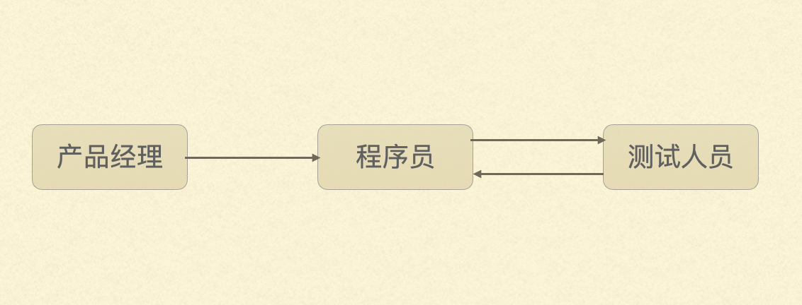
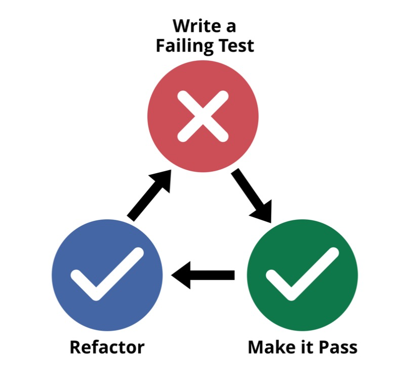

# 程序员如何一边写bug一边写代码

## 引言 

冒昧地问你一下，上次遇到一个复杂问题时，你犯了哪些错误？从中有什么收获？ 

为什么要讲错误这个话题？“对不起，我是程序员。”

 你肯定遇到过类似手机上的App突然卡住，闪退，版本更新之后某个功能不能用了之类的情况，那便是我们程序员犯的错。我们把这些错叫做bug，bug的意思是虫子。

说起bug有一段典故，那是在1945年秋天的一个下午，那时的计算机有几个房间那么大。突然，那台大型计算机死机了，经过排查，有只飞蛾夹在继电器中间引起短路，这是计算机史上第一个有记录的“bug”。~~顺便说一下，发现这个bug的是一位女程序员，她后来成了美军海军少将。~~

就是中间的那只“虫子”，因此，我们调试bug的过程也会被戏称为“捉虫”。 

“没有深夜改过bug的人，不足以谈开发”。 嗯，“我通宵编程，两耳不闻人声，只有键盘在歌唱。” 

~~当我们刚解决一个bug，还没缓口气的时候，测试和产品经理早等在旁边一脸坏笑，抛出灵魂三问：“今天写了几个bug？还有几个bug要改？新的需求什么时候可以派上？”~~

##  挑战是什么？ （软件频繁添加新功能，修改旧工程，依旧保持可以正常使用）

为什么软件就不能没有bug？除了一些大型软件本身就很复杂之外，还有一部分原因就是因为它是软件。

相比硬件，软件会被不断地修改，功能越来越多，越来越复杂，这也就意味着越来越容易出错。你看，我们的手机买到手之后，不会功能上的变化。但是手机里的“得到”App， 恨不得一周一个版本。所以我们在发布程序新版本的时候，面临两个挑战

1. 新实现的这些功能必须是正常可用的。
2. 上一个版本正常的功能要仍然是正常的。

你也许认为第二点很容易，不应该天生如此吗？想象一下，如果你的手机每周拆卸一次，改个零件，换个模块，会不会容易出问题。

举个大家熟悉的得到阅读器的例子，这是刀哥在知识城邦里的道歉，一次重大的升级，升级之后，最重要的电子书突然不能用了。

bug不可控很大程度上导致了项目时间不可控。猜一猜，当程序员一脸诚恳地告诉你已经完成了90%，实际的整个项目完成率是多少？有经验的产品经理都要打个5折。

## 解决方案 

在软件开发领域，从理解需求，到框架设计，代码编写，程序测试，项目复盘都有一套应对bug的方式。今天我把开发过程中最有“技术含量”的这一部分拿出来分享。不用担心，没有代码。

举个例子，我们现在要开发一个汇率转换的小模块1.0版本，很简单，假设现在人民币美元的汇率是6：1，你兑换6元人民币，就能得到1美元。

### 常见开发流程

常见的开发流程是这样的，程序员按照产品经理的需求开发完程序，然后提交给测试人员。测试人员发现问题，再反馈给开发人员。一直重复，有时要测试好几轮。

就上面人民币和美元兑换的例子，测试人员至少会验证下面这些情况，他就拿起手机开始测试。

1. 输入6元人民币是不是能换1美元
2. 输入100元人民币兑换的美元是不是xxx
3. 0 元人民币
4. 输入一个负数是不是能报错误，或者界面上就不允许用户输入一个负数
5. 假设最大兑换金额是10000元人民币，10000能兑换对少美元？
6. 输入10001元人民币，看看是否提示错误

这个流程有什么问题？

1. 这个过程就像是程序员先挖坑，测试人员踩到坑了，再让程序员填坑，修改的功能多一点的话，挖坑和填坑的时间间隔就会比较长。
2. 每一次小的改动，不敢保证之前的工程都是正常的。就像觉得阅读器升级的例子。

软件行业有个规律，bug被发现的越早，代价就越低，这个是在项目不同阶段发现bug的成本

### 测试驱动开发

测试驱动开发的核心步骤

1. 在写功能代码之前，先写一个测试的代码，这个测试肯定会失败，因为具体的功能还没实现。
2. 编写功能代码，让测试通过即可。（这个过程一般就几分钟）
3. 编译通过完之后，看看是否有必要优化代码结构，例如提取一些功能，消除重复的代码。
4. 重复1-3.开始下一个小功能。

也是上面那5个测试用例，这一回是由程序员编写测试代码来验证功能，而不是测试手动输入来测试。从第一个测试用例到最后一个，当程序完成的时候，也就有了5个测试用例。

测试人员提交了一个新bug了怎么处理？写一个新的测试代码，让这个错误重现，接下来的流程就和上面的一样了。

## 应对复杂问题的两个个心法

解决类似软件开发这种复杂问题，有2个心法：

1）小步迭代获得最快反馈

测试驱动驱动开发最重要一点就是小布迭代的节奏。因为步子小，如果有问题，能够马上发现，这个周期大概就十几分钟。错误发现地越早，解决的代价就越低。

2）积累沉淀获得叠加进步

因为有测试用例的存在，每完成一个新功能，都可以保证在我们已知的范围内是正常的。即使新版本中不小心改到旧功能时，能够在第一时间被测试用例发现。我们在软件开发过程中获得的进步是可叠加的。特别像曾国藩说的：“结硬寨，打呆仗”

错误不是我们前进的绊脚石，而是前进的探照灯。它界定了我们正确行为的边界。有了这样的认识，就会明白，每次犯错不是自己的否定，而是一次成长的机会。

## 引用

1. [历史上的第一个bug](http://www.cxyym.com/2014/11/999/)： http://www.cxyym.com/2014/11/999/