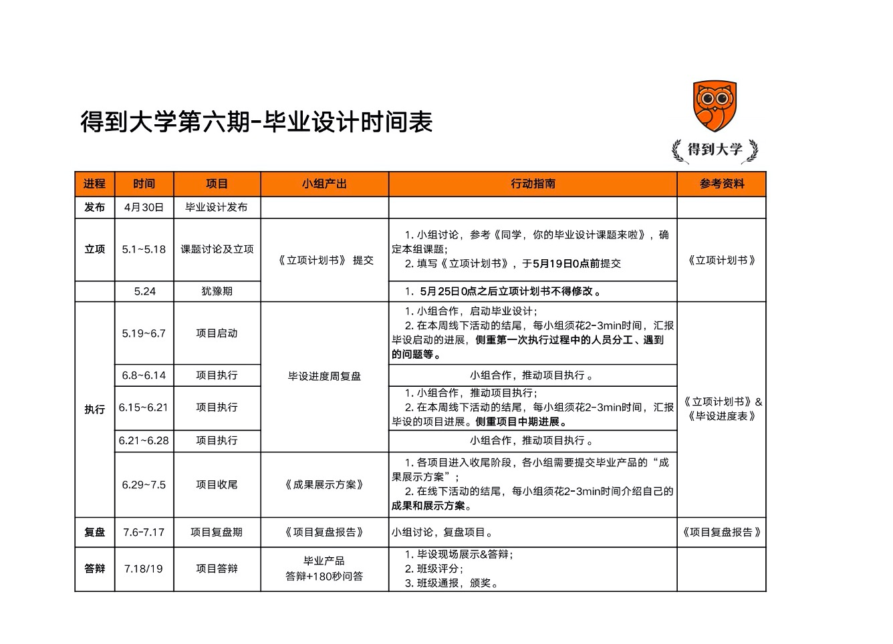

# 我和你--增进与生命中重要的人之间的连接

## 项目内容

### 项目立意

现代社会很多人工作，越是重要的人的关系越容易被忽略。对于大多数人来说，与他人的关系能够很大程度上影响个人幸福程度。因此，我们希望开展一次研究：做一些事情增进与你生命中重要的人之间的连接。

“幸福的家庭都是类似的，不幸的家庭各有各的不幸”，对一个人来说有效幸福方法，对另外一个人来说大概率上也会有效。因此，我们可以一起实践。

请注意，这是一个一边学习一边实践的项目。如果我们觉得有改进的地方，那就是说以前说得不够好。在做这件事之前，可以搜索、调查、学习身边做的比较好的人是怎么做的。受自己的经验所限，一开始想到的那个方案很可能有很大的提升空间。

### 项目目标

通过我们自己的实践，去探寻增进生命中重要的人之间连接的方法，彼此分享。

### 项目形式

形式开放，每个人会有各自的做法和创意，“参差多态才幸福本源”。我们可以想象几个场景。

1. 你生命中是否有那两三个人，你希望增进彼此的连接？你能想到为此做点什么？

2. 假设明天是你在这世上的最后一天，这时你会想起谁？

3. 古今中外，现实中或虚构的人物，如果你能和任何一个人待在一起一个下午，那会是谁？做些什么？

4. 日常生活中有哪些细小的事件让你感受到了幸福，参考“花姐的卧槽日记”。

5. 此时此刻，回顾过往，你和哪些人哪些事情错过了？如果有月光宝盒穿梭回去，你会跟那时的你说些什么，让他做些什么？

6. 就像《在那遥远的地方》歌里里唱的，“我愿抛弃了财产，跟她去放羊， 我愿做一只小羊，跟她去放羊。我愿她拿着细细的皮鞭，不断轻轻打在我身上 ” 都说相爱容易相处难，回想起恋爱时候，婚姻生活。想为此做一些什么？

7. 如果你已经做得很好了，欢迎你直接分享亲测有效的经验。如果你做得不好，欢迎分享你的思考、总结和改进。

8. 举个例子，还是不举了，这个是开放的项目。

   

## 对外展示方式

团队的整合报告（文字+图片+视频）

1. 一份5000字的项目复盘记录。
2. 一份18分钟的分享逐字稿、PPT、视频材料
3. 12位同学的2篇500字实践记录，集结成册
4. 一些看了就知道如何操作的实践清单（例如出去跑步5公里，比出去运动一下更明确），以下的可能的例子
   1. 促进和父母、爱人、好友沟通的10个问题，增进和他们感情的10件事
   2. 可以和孩子一起玩的10个游戏
   3. 自己独处的时候可以做的10件事
   4. ...

 每个成员需要提交：

1. 你的行动方案

2. 两篇实践总结，每篇500字以上，我们会集结成册。（由于可能涉及到隐私，可以隐去个人信息，如果需要，我们会做到小组内匿名。在小组报告的时候，不会提到个人信息。）

3. 强烈建议你拍下过程中的照片或者视频，可供日后回忆。也可作为小组报告的素材。人总是很健忘，有时候需要一些照片、视频提醒自己曾经美好的样子。

4. 自己 ***亲测有效或者无效*** 的实践清单，一起完善上面的那些清单。

   

   

## 项目执行

## 分工和计划

| 姓名           | 分工                   | 截止时间       | 项目进展 |
| -------------- | ---------------------- | -------------- | -------- |
| 陈文经、李志威 | 发布项目计划           | 5月24日        | 已发布   |
| 所有人         | 提交行动方案           | 5月30日        |          |
| 所有人         | 输出第一篇实践报告     | 6月13日        |          |
| 所有人         | 输出第二篇实践报告     | 6月24日        |          |
| 所有人         | 项目收尾，成果展示方案 | 6月29日-7月5日 |          |
| 所有人         | 项目复盘报告           | 7月6-17日      |          |
| 答辩人         | 项目答辩               | 7月18、19日    |          |

## 参考资料

1. 陈海贤亲密关系30讲 – 得到课程

2. 跟熊浩学沟通30讲  -- 得到课程

3. 王太平 摄影讲座  -- 得到讲座

4. 如何用手机拍一部电影 – 电子书

5. 非暴力沟通 -- 电子书

欢迎大家大家补充能够用到的材料

## 毕业设计日志

5月25日 项目计划发布

5 月27日 mason，wenjing 发布行动计划

## 行动计划

### mason

1. 和女儿关系的改进

   问题：女儿出身以后，还没有认真的好好研究一下应该如何去教育和引导女儿，和她在一起的时间也不是很多，很多时间还是把她推出去，让她自己玩或者找妈妈。没有认真的讲一下故事，或者全身心的投入和她在一起的时间。

   措施：每天30分钟，给她讲故事，或者陪她一起游戏，形成习惯，先做一周。 

2. 和父亲的关系改进

   问题：一直和父亲的关系比较疏离

   措施：希望可以和父亲好好地沟通，或者两个人一起做一件事，谈谈体悟，去理解对方。比如陪他一起去钓鱼

### wenjing

1. 和妻子

   2013年结婚到今年刚好七年之痒，自己比较少主动做点什么。从“亲密关系30讲”开始。

2. 和女儿

   虽然看过不少育儿课程，但是实践较少。女儿一直跟妈妈比较亲近，因为疫情回老家待了4个多月。我想从陪伴她上“泉灵的语文课”开始

3. 和父母

   印象中没有跟父母深谈过一次，下个月回家一趟。

## 时间表

